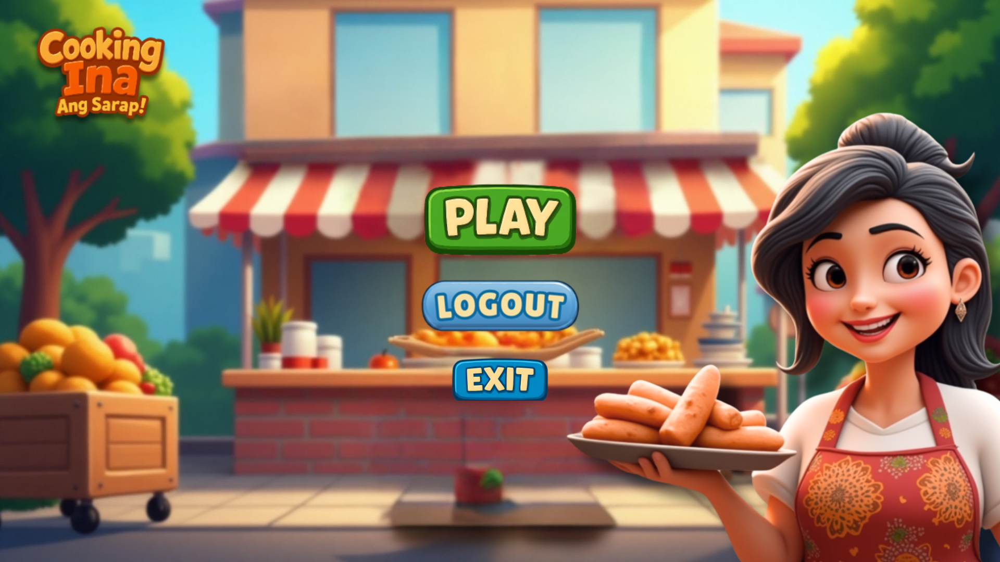
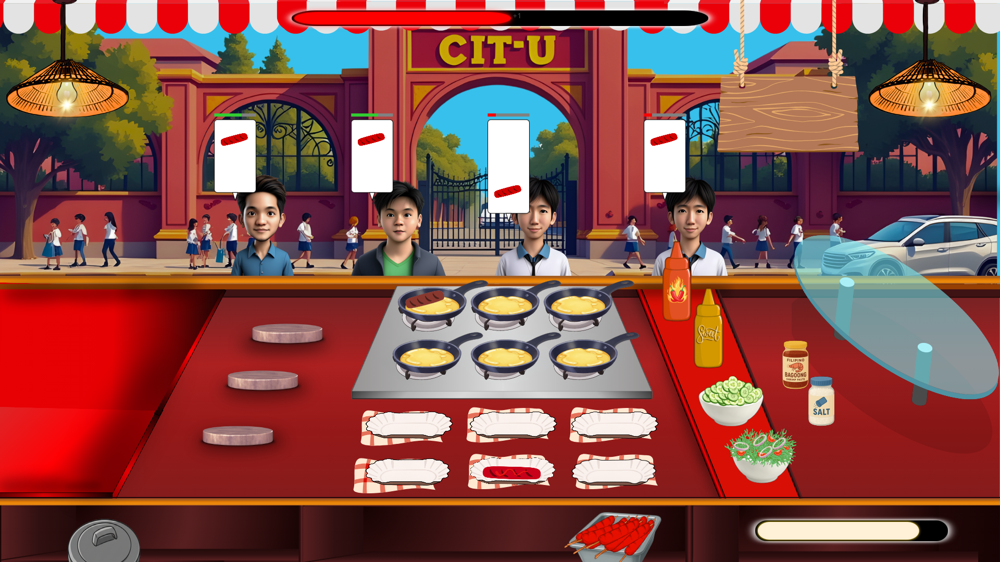

# CookingIna

  
  
  
  

Members:
 - Fernandez, Christian Luis C.
 - Guadiana, Sherielyn C.
 - Lomocso, Austine John P.
 - Olodin, Krizza Beth M.
 - Tabernero, Shervin Dale M.

Game Title: Cooking Ina, Ang Sarap!

Game Summary Plot: 

Set in the bustling streets behind Cebu Institute of Technology – University, Nanay’s Merienda Quest follows the heartfelt story of Aling Bileth, a resilient Filipina mother determined to provide a better life for her young daughter, Libeth. After losing her husband to illness and struggling with mounting debts, Aling Bileth sets up a humble merienda stall near CIT-U’s backgate, serving classic Filipino favorites.

Players step into her slippers—literally—as she juggles cooking, managing supplies, fending off competitors, and serving a diverse crowd of students, teachers, and workers. But it’s more than just a business; every coin earned is a step closer to paying Toto’s school fees and ensuring he never has to give up his dreams.

As days pass, Aling Bileth must navigate through challenges: rising ingredient costs, food critics from campus blogs, and even rumors of a big fast food chain moving in. With choices affecting both her business and personal life, the player helps her stay true to her values, build lasting community bonds, and discover that success isn’t just about money—but love, sacrifice, and flavor passed down through generations.

Will Aling Rosa’s humble stall survive and thrive, or will it be swept away by the tide of change?

Cooking Ina, Ang Sarap! Related Games: 
1. Cooking Fever
2. Hotdog Bush

Game Objectives:
1. Number of Players:
   - 1 Player
2. Number of Levels:
   - TBA
3. Winning the level
   - The player must earn the target income before the stall closes (when the time runs out)
4. Losing the Level
   - Time runs out without meeting the target income
     (Note: Patience's Level of customers and inaccurate serving of food deducts their tip, thus affecting the income.)
5. Leveling Up:
  - reaching higher levels will have target income increased, number of customers increased (based on the total income obtained from the orders), patience level decreased.
   
